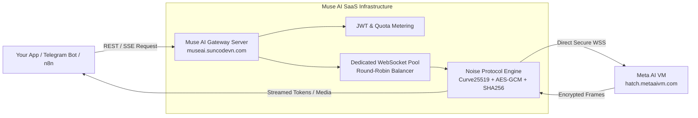

<div align="center">

# 🚀 MUSE AI STUDIO & API GATEWAY
### Universal High-Performance RESTful API, SSE Streaming & SaaS Gateway for Meta Muse AI
**Direct Noise Protocol (`Noise_XX_25519_AESGCM_SHA256`) & WebSocket Connection to Meta Virtual Machines**

[](https://museai.suncodevn.com/)
[](https://nodejs.org/)
[](https://react.dev/)
[](https://tailwindcss.com/)
[](LICENSE)

[**🌐 Live Studio Playground**](https://museai.suncodevn.com/) • [**📖 Interactive API Docs**](https://museai.suncodevn.com/docs) • [**💬 Support & Community**](https://museai.suncodevn.com/)

---

### 🌐 Language Navigation / Chuyển Đổi Ngôn Ngữ
[**🇬🇧 English Documentation**](#-english-documentation) &nbsp;|&nbsp; [**🇻🇳 Tài Liệu Tiếng Việt**](#-tài-liệu-tiếng-việt)

---

</div>

## 📌 Global SEO Keywords & Tags
`muse ai`, `meta muse ai`, `meta ai api`, `muse ai api`, `muse api wrapper`, `meta muse reverse engineered`, `noise protocol client`, `meta ai video generator api`, `imagine diffusion api`, `meta ai chat sse`, `meta vm websocket`, `saas boilerplate 2026`, `crypto usdt payment`, `vietqr sepay gateway`

---

<a name="english-documentation"></a>
# 🇬🇧 English Documentation

## 🌟 Overview

**Muse AI Studio** (hosted at [**https://museai.suncodevn.com/**](https://museai.suncodevn.com/)) is a production-grade **SaaS Gateway and Developer Hub** that reverse-engineers and standardizes Meta Muse AI's proprietary end-to-end encrypted **Noise Protocol (`Noise_XX_25519_AESGCM_SHA256`)** and WebSocket architecture into clean, developer-friendly **RESTful APIs** and **Server-Sent Events (SSE)**.

Whether you want to build autonomous AI agents, Telegram/Discord chatbots, automated content creation workflows (n8n/Make), or integrate Meta AI's state-of-the-art **Imagine Image Diffusion** and **MP4 Video Generation** into your products, this platform handles all session orchestration, encryption handshakes, datacenter IP bypass, and token streaming for you.

---

## ⚡ Key Highlights & Architecture

### 1. 🔌 Bring Your Own Account (Dedicated WebSocket Pool)
- **Zero Datacenter IP Blocking**: Meta strictly limits requests originating from VPS/Cloud Datacenter IPs. By feeding a **direct WebSocket link (`wss://...`)**, the backend connects straight to the assigned Meta VM, **100% bypassing datacenter IP restrictions**.
- **Automated Round-Robin Rotation**: Plug in multiple Meta accounts. The built-in client pool dynamically balances loads across accounts to maximize concurrency and avoid rate-limiting.

### 2. 🎨 3-in-1 Generative Capabilities
- 💬 **Real-time Chat Streaming (SSE)**: Low-latency token-by-token response streaming with persistent context memory.
- 🖼️ **Imagine Diffusion Image Generator**: High-resolution photorealistic image creation from natural text prompts. Provides both direct CDN URLs and Base64 payloads.
- 🎬 **AI Video Generator (MP4)**: Motion synthesis transforming text into MP4 video with synchronous and asynchronous polling modes.

### 3. 💳 Automated Dual Payment Engine
- **VietQR Bank Transfer (SePay)**: Real-time QR generation with instant IPN webhook confirmation.
- **USDT Crypto Payments**: TRC20 / BEP20 cryptocurrency payment confirmation for global clients.

### 4. 💎 Meta/Facebook Modern Design System
- Sleek dark mode (`#18191A`), crystal-clear typography, mobile-first responsive navigation, and zero annoying page reloads.

---

## 🏛️ System Architecture



---

## 🚀 Getting Started in 3 Simple Steps

### Step 1: Create an Account & Get Your API Key
1. Go to [https://museai.suncodevn.com/](https://museai.suncodevn.com/) and create your developer account.
2. Navigate to your **Dashboard** or **Settings** to retrieve your unique **API Key**.

### Step 2: (Optional) Plug in Your Own Meta Account (Dedicated Pool)
If you already possess a Meta Muse AI account, extract your direct WebSocket URL (`wss://...`) via DevTools and paste it into **Settings > Dedicated Cookie Pool**. This allows your API calls to run exclusively on your private Meta VM with dedicated throughput.

### Step 3: Start Calling the API
Include your API Key in the authorization header and call any of the endpoints below.

---

## 📡 Global API Reference & Code Samples

Include your authorization token in all requests:
```http
Authorization: Bearer YOUR_MUSE_API_KEY
Content-Type: application/json
```

### 1. Chat AI Streaming (Server-Sent Events)
* **Endpoint**: `POST https://museai.suncodevn.com/api/v1/chat`

#### Python
```python
import requests, json

url = "https://museai.suncodevn.com/api/v1/chat"
headers = {
    "Authorization": "Bearer YOUR_MUSE_API_KEY",
    "Content-Type": "application/json"
}
payload = {
    "prompt": "Explain Quantum Computing in 3 simple sentences.",
    "stream": True
}

with requests.post(url, json=payload, headers=headers, stream=True) as response:
    for line in response.iter_lines():
        if line:
            text = line.decode('utf-8')
            if text.startswith("data: "):
                chunk = json.loads(text[6:])
                if chunk.get("type") == "delta":
                    print(chunk.get("token", ""), end="", flush=True)
print()
```

---

### 2. Imagine Image Generation
* **Endpoint**: `POST https://museai.suncodevn.com/api/v1/generate-image`

#### Node.js (Axios)
```javascript
const axios = require('axios');
const fs = require('fs');

async function generate() {
  const res = await axios.post('https://museai.suncodevn.com/api/v1/generate-image', {
    prompt: 'Hyperrealistic portrait of an astronaut on Mars, golden hour, 8k resolution',
    include_base64: true
  }, {
    headers: { 'Authorization': 'Bearer YOUR_MUSE_API_KEY' }
  });

  if (res.data.success) {
    console.log('Image URL:', res.data.image_url);
    if (res.data.base64) {
      fs.writeFileSync('astronaut.png', Buffer.from(res.data.base64, 'base64'));
      console.log('Saved astronaut.png');
    }
  }
}
generate();
```

---

### 3. AI MP4 Video Synthesis
* **Endpoint**: `POST https://museai.suncodevn.com/api/v1/generate-video`

#### cURL
```bash
curl -X POST https://museai.suncodevn.com/api/v1/generate-video \
  -H "Authorization: Bearer YOUR_MUSE_API_KEY" \
  -H "Content-Type: application/json" \
  -d '{
    "prompt": "Majestic golden eagle soaring above misty mountain peaks, slow motion 4k",
    "async": false
  }'
```

---

### 💡 10-Second Guide: How to Grab Direct `wss://` WebSocket URL

1. Open your desktop browser and log in to [muse.ai](https://muse.ai).
2. Press **F12** to open Chrome DevTools.
3. Switch to the **Network** tab (next to Console) $\rightarrow$ Click **WS** filter (or type `noise` in Filter).
4. Press **F5** to refresh the page.
5. Right-click the connection named `noise?vm_id=...` $\rightarrow$ **Copy** $\rightarrow$ **Copy URL** *(starts with `wss://hatch.metaaivm.com/...`)*.
6. Paste this `wss://` URL into [Admin / User Dedicated Cookie Pool](https://museai.suncodevn.com/settings) $\rightarrow$ Instantly connected!

---

<br/>

<a name="tai-lieu-tieng-viet"></a>
# 🇻🇳 Tài Liệu Tiếng Việt

## 🌟 Giới Thiệu Tổng Quan

**Muse AI Studio** (vận hành chính thức tại [**https://museai.suncodevn.com/**](https://museai.suncodevn.com/)) là nền tảng **SaaS Gateway & Developer Hub** chuyên nghiệp, giải mã và đóng gói toàn bộ giao thức truyền thông mã hóa **Noise Protocol (`Noise_XX_25519_AESGCM_SHA256`)** của Meta Muse AI thành các chuẩn **RESTful API & Server-Sent Events (SSE)** thân thiện và dễ dàng tích hợp.

Dự án giúp bạn dễ dàng đưa các tính năng AI hàng đầu của Meta vào:
- Bot Telegram, Bot Discord, Zalo OA.
- Tự động hóa sáng tạo nội dung với n8n, Make, Flowise.
- Website, ứng dụng di động, tiện ích mở rộng Chrome.

---

## ⚡ Các Tính Năng Nổi Bật

1. **Hồ Chứa Cookie & WebSocket Riêng (Dedicated Pool)**:
   - Dán trực tiếp **đường link WebSocket (`wss://...`)** để kết nối thẳng vào máy ảo Meta VM.
   - **Vượt qua triệt để việc chặn IP Datacenter**: Không lo Meta khóa dải IP máy chủ VPS.
   - **Cân bằng tải xoay tua (Round-robin)**: Luân phiên gọi qua nhiều tài khoản Meta để tối đa hóa hiệu năng.

2. **Bộ 3 Siêu Năng Lực AI Toàn Diện**:
   - 💬 **Chat Streaming (SSE)**: Nhận phản hồi chữ theo luồng thời gian thực, lưu ngữ cảnh phiên mượt mà.
   - 🖼️ **Imagine Diffusion**: Tạo ảnh nghệ thuật độ phân giải cao cực nét chỉ sau vài giây.
   - 🎬 **AI Video Generator**: Sinh video chuyển động MP4 chất lượng cao từ câu lệnh prompt.

3. **Studio Playground Trực Quan**:
   - Trải nghiệm trực tiếp cả 3 tính năng ngay trên web tại [https://museai.suncodevn.com/studio](https://museai.suncodevn.com/studio).
   - Tặng ngay **3 lượt dùng thử miễn phí** cho mỗi khách truy cập (bảo vệ bởi Cloudflare Turnstile).

4. **Cổng Thanh Toán Tự Động 100%**:
   - **VietQR (SePay)**: Quét mã QR ngân hàng tự động, tiền vào tài khoản là kích hoạt nạp requests ngay sau 2 giây.
   - **USDT Crypto (TRC20 / BEP20)**: Thanh toán tiền mã hóa nhanh chóng cho khách hàng toàn cầu.

5. **Giao Diện Chuẩn Facebook Modern Design**:
   - Hỗ trợ Dark Mode & Light Mode chuẩn Meta, giao diện mượt mà, không bị load lại trang khi server phản hồi.

---

## 🚀 Bắt Đầu Tích Hợp API Trong 3 Bước Đơn Giản

### Bước 1: Đăng Ký Tài Khoản & Lấy API Key
1. Truy cập [https://museai.suncodevn.com/](https://museai.suncodevn.com/) và đăng ký tài khoản lập trình viên.
2. Vào mục **Bảng Điều Khiển** hoặc **Cài Đặt** để sao chép **API Key** cá nhân của bạn.

### Bước 2: (Tùy Chọn) Kết Nối Tài Khoản Meta Riêng
Nếu bạn đã có tài khoản Meta Muse AI, hãy lấy link WebSocket (`wss://...`) theo hướng dẫn bên dưới và dán vào mục **Cài Đặt > Hồ Cookie Riêng** để tận dụng toàn bộ hạn mức máy ảo riêng biệt của bạn.

### Bước 3: Gọi API Vào Ứng Dụng
Sử dụng API Key vừa nhận được và gọi các endpoint tạo ảnh, video hoặc chat theo tài liệu mẫu.

---

## 💡 Hướng Dẫn 10 Giây Lấy Link WebSocket Trực Tiếp (`wss://`)

1. Mở trình duyệt PC đã đăng nhập [muse.ai](https://muse.ai) $\rightarrow$ Nhấn **F12** mở DevTools.
2. Chọn tab **Network** $\rightarrow$ Chọn bộ lọc **WS** (hoặc gõ chữ `noise` vào ô Filter).
3. Nhấn **F5** để tải lại trang `muse.ai`.
4. Chuột phải vào kết nối có tên `noise?vm_id=...` $\rightarrow$ Chọn **Copy** $\rightarrow$ **Copy URL**.
5. Vào [Trang Quản Trị / Cài Đặt Hồ Cookie](https://museai.suncodevn.com/settings) $\rightarrow$ Dán đường link `wss://...` đó vào ô **Đường Link WebSocket Trực Tiếp** $\rightarrow$ Kết nối thành công ngay lập tức!

---

## 🤝 Đóng Góp & Hỗ Trợ (Contributing & Support)

* Nền tảng chính thức: [https://museai.suncodevn.com/](https://museai.suncodevn.com/)
* Tài liệu chi tiết: [https://museai.suncodevn.com/docs](https://museai.suncodevn.com/docs)
* Giấy phép phân phối: **MIT License**.

<div align="center">
  <sub>Bản quyền © 2026 <a href="https://museai.suncodevn.com/"><strong>Muse AI Platform & SunCodeVN</strong></a>. Toàn quyền bảo lưu.</sub>
</div>
